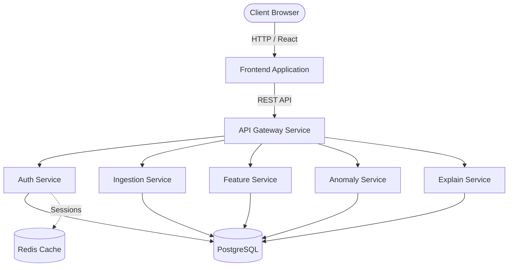
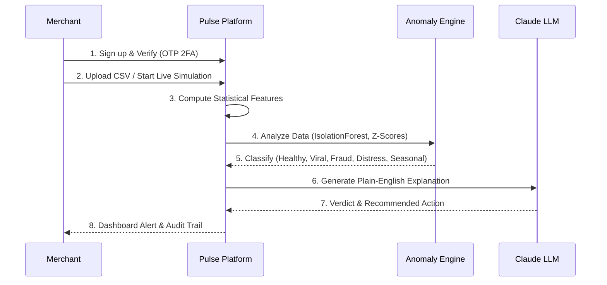

# ⚡ PULSE

**AI-powered Merchant Health Monitoring Platform**

Pulse watches the *shape* of trading behaviour — velocity, ticket size, repeat-customer rate, refund rate — rather than just daily totals. It flags a turn weeks before it shows on a standard dashboard, distinguishing a real breakout from a fraud ring when both look like revenue growth. 

It recommends, never moves money: every alert requires a human decision.

---

## 🎯 What it Serves

Independent merchants who self-onboard to monitor their own business health. They are non-technical operators — shopkeepers, SME founders, D2C sellers — who upload or stream transaction data and rely on Pulse to tell them when something is wrong, why, and what to do.

### Key Principles
- **Verdict over data**: Every output is a decision aid, not a raw metric.
- **Explainability is the product**: The *why* is as important as the *what*.
- **Recommend, never act**: Pulse proposes; humans decide.
- **Early, not reactive**: Signal weeks before a dashboard would show it.
- **Trust through transparency**: Every score has an audit trail a user can open and follow.

---

## 🏗️ Architecture

Pulse is built on a robust, asynchronous microservice architecture using React, Python FastAPI, PostgreSQL, and Redis.



---

## 🧭 How it Works

Pulse abstracts away complex machine learning models into simple, actionable insights. Here is the lifecycle of a merchant's data inside Pulse:



---

## 🚀 Getting Started

You can run Pulse either using **Docker Compose** (recommended for Linux/Mac) or natively using the included startup scripts (recommended for Windows).

### Important: Required Services
Before starting, you must configure two external services in `backend/.env`:
1. **Redis**: Pulse uses Redis for rate limiting and JWT token validation. If you cannot run Redis locally via Docker, create a free database at [Upstash](https://upstash.com/) and paste the `rediss://...` URL into your `.env` file as `REDIS_URL`.
2. **Twilio Verify**: Pulse uses Twilio Verify for phone number OTPs. Create a free Twilio account, configure a Verify Service, and paste your `TWILIO_ACCOUNT_SID`, `TWILIO_AUTH_TOKEN`, and `TWILIO_VERIFY_SERVICE_SID` in `.env`. *(If you leave these blank, the backend will print fallback OTPs into the server console for local testing).*

---

### Option A: Windows Native Startup (Recommended for Windows)

If you have Python and Node.js installed on Windows, you can start everything with a single click.

1. **Clone the repository:**
   ```cmd
   git clone https://github.com/Krishna0659/PULSE-.git
   cd PULSE-
   ```
2. **Set up environment variables:**
   Copy `backend/.env.example` to `backend/.env` and fill in your Anthropic API Key, Twilio Verify SID, and Redis URL.
3. **Run the startup script:**
   Double-click `start_all.bat` in the root folder, or run it from the command prompt:
   ```cmd
   .\start_all.bat
   ```
   *This script will attempt to start a local Redis Docker container. If Docker is not running, ensure you configured Upstash in your `.env`!*

---

### Option B: Docker Compose (Recommended for Mac/Linux)

The easiest way to run the entire Pulse stack in isolated containers.

### Prerequisites
- [Docker](https://docs.docker.com/get-docker/) & Docker Compose installed
- Make sure ports `3000` (Frontend), `8000-8005` (Backend services), `5432` (PostgreSQL), and `6379` (Redis) are available on your host machine.

### Quick Start

1. **Clone the repository:**
   ```bash
   git clone https://github.com/Krishna0659/PULSE-.git
   cd PULSE-
   ```

2. **Set up environment variables:**
   Copy the example environment files for the backend.
   ```bash
   cd backend
   cp .env.example .env
   ```
   > **Note:** Make sure to open the `.env` file and add your `ANTHROPIC_API_KEY` to enable the Explain Service!

3. **Start the stack using Docker Compose:**
   Navigate back to the project root and spin up the containers:
   ```bash
   cd ..
   docker-compose up --build -d
   ```
   *This process might take a few minutes the first time as it builds the Docker images.*

4. **Access the application:**
   - **Frontend UI:** [http://localhost:3000](http://localhost:3000)
   - **API Gateway:** [http://localhost:8000](http://localhost:8000)

5. **Stop the stack:**
   When you're finished, you can gracefully stop the containers:
   ```bash
   docker-compose down
   ```

---

## 📂 Repository Structure

- `/frontend` - React, Tailwind CSS, Framer Motion, Recharts
- `/backend` - Python FastAPI Microservices
  - `/auth-svc` - Authentication, Phone OTP, Session Management
  - `/ingestion-svc` - CSV Parsing & Transaction Simulation
  - `/feature-svc` - Feature engineering & metric computation
  - `/anomaly-svc` - ML Classification (IsolationForest, CUSUM)
  - `/explain-svc` - LLM-powered explanations (Anthropic Claude)
  - `/gateway-svc` - Unified API Gateway routing requests
- `docker-compose.yml` - Container orchestration for local development
